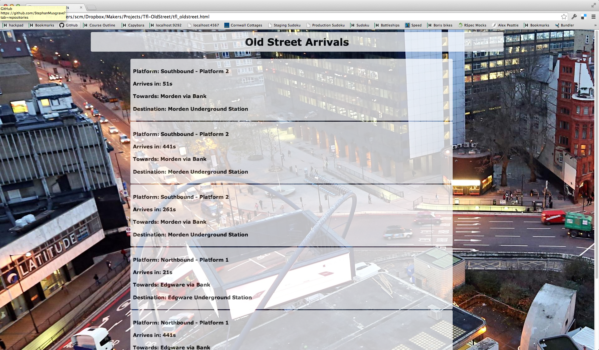

TFL - Old Street Arrivals 
===
We created an app that checks the arrivals at Old Street Underground Station, London from the Traffic for London live data stream.



Objectives of exercise
----
Learning to implement apps using a novel API in a Javascript environment.

Technologies used
----
- Javascript
- Jquery
- Mustache.js
- Underscore.js
- HTML5
- CSS3
- Git
- [TFL Api]

How to run it
----
```sh
git clone git@github.com:NicoSa/Tfl-OldStreet.git
cd Tfl-OldStreet
open tfl_oldstreet.html
```

Pairing Partners
----
[Steve],[Nico]

[Steve]:https://github.com/StephanMusgrave
[Nico]:https://github.com/NicoSa
[TFL Api]:http://api.tfl.gov.uk/